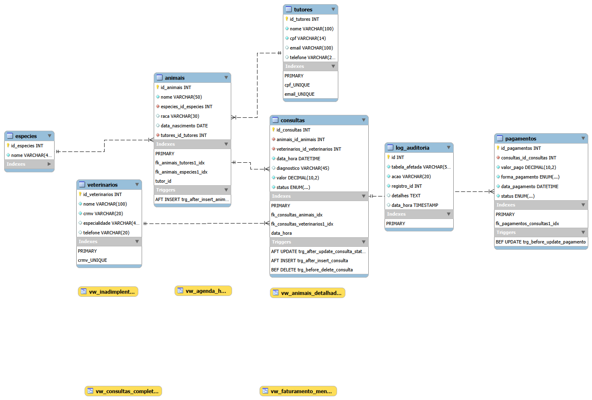

# Pet Vida API

  

## Descrição do Projeto

A **Pet Vida API** é uma API RESTful desenvolvida para gerenciar uma clínica veterinária completa, oferecendo controle de tutores, animais, consultas, pagamentos e relatórios. A aplicação foi construída com **Node.js** e **Express**, utilizando **MySQL** como banco de dados relacional.

O projeto foi projetado para facilitar integrações com frontends e aplicativos móveis, permitindo operações de CRUD consistentes e desempenho confiável. Ele também conta com a **Licença MIT** e inclui um `.gitignore` para proteção de arquivos sensíveis como `node_modules` e o arquivo `.env`.

## Modelagem do Banco de Dados

Abaixo está a referência para o Diagrama de Entidade-Relacionamento (DER):



## Tecnologias Utilizadas

- **Node.js**
- **Express**
- **MySQL**

## Instruções de Instalação e Execução

```bash
# 1. Clone o repositório
git clone https://github.com/seu-usuario/pet-vida.git
cd pet-vida

# 2. Instale as dependências
npm install

# 3. Crie o arquivo de variáveis de ambiente
copy .env.example .env

# 4. Configure as variáveis no .env
# Exemplo:
# DB_HOST=localhost
# DB_USER=root
# DB_PASSWORD=senha
# DB_NAME=pet_vida
# PORT=3000

# 5. Inicie a aplicação
npm start
```

> O `.gitignore` protege arquivos sensíveis como `node_modules` e o `.env`, evitando que essas informações sejam adicionadas ao repositório.

## Tabela de Endpoints da API

| Método | Endpoint | Descrição | Status Code de Sucesso |
| --- | --- | --- | --- |
| GET | `/api/tutores` | Lista todos os tutores | `200` |
| POST | `/api/tutores` | Cria um novo tutor | `201` |
| PUT | `/api/tutores/:id` | Atualiza um tutor existente | `200` |
| DELETE | `/api/tutores/:id` | Remove um tutor | `204` |
| GET | `/api/animais` | Lista todos os animais | `200` |
| POST | `/api/animais` | Cadastra um novo animal | `201` |
| GET | `/api/consultas` | Lista todas as consultas | `200` |
| POST | `/api/consultas` | Agenda uma nova consulta | `201` |

## Estrutura de Pastas

```
Pet_vida/
├── LICENSE
├── .gitignore
├── package.json
├── package-lock.json
├── server.js
├── README.md
├── .env
├── backups/
│   └── petvida_2026-06-16.sql
├── database/
│   ├── backup.sh
│   ├── reports.sql
│   └── security.sql
├── docs/
│   └── der.png
├── db_pet_vida/
│   ├── schema.sql
│   ├── seed.sql
│   ├── procedure.sql
│   ├── triggers.sql
│   ├── view.sql
│   ├── functions.sql
│   └── prints/
│       └── ...
└── src/
    ├── app.js
    ├── config/
    │   └── database.js
    └── routes/
        ├── app.js
        ├── animais.js
        ├── consultas.js
        ├── especies.js
        ├── pagamentos.js
        ├── relatorios.js
        ├── tutores.js
        └── veterinarios.js
```

## Contato

- Juliana Evangelista Simão dos Santos
- LinkedIn: [https://www.linkedin.com/in/juliana-santos-52bb49275]
